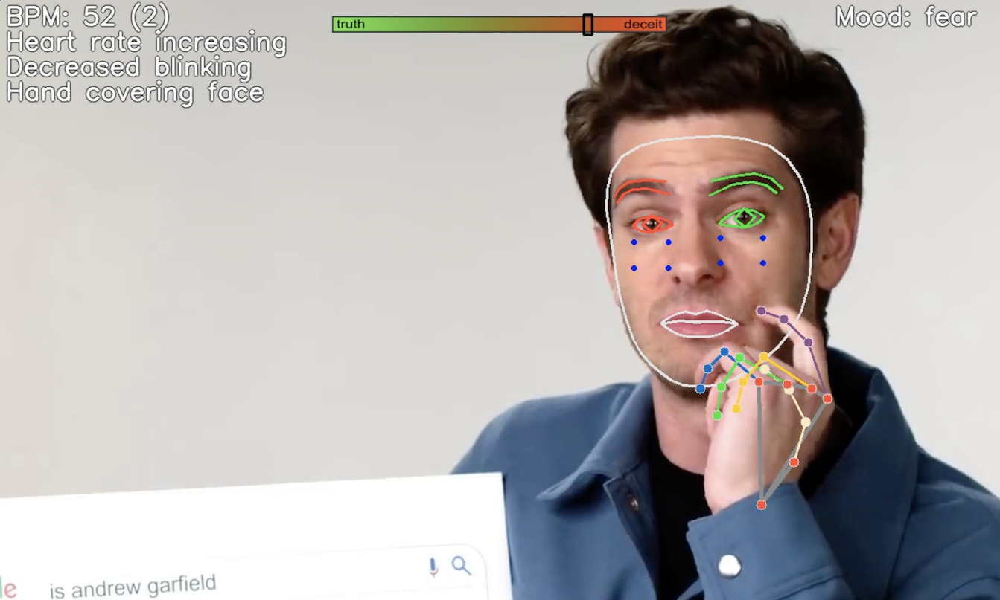

## Truthsayer
### A Remote-Control Lie Detector

Truthsayer lets you monitor the heart rate and possible 'tells' of deception from any face, including live video calls or recordings.

Video demo and more info [available 
here](https://youtu.be/5q-BQ2Q_pqI)!

TruthSayer uses [OpenCV](https://github.com/opencv/opencv-python) and MediaPipe's [Face Mesh](https://google.github.io/mediapipe/solutions/face_mesh.html#python-solution-api) to perform real-time detect of facial landmarks from video input. It also uses [FER](https://pypi.org/project/fer/) for mood detection. From there, relative differences are calculated to determine significant changes in specific facial movements from a person's baseline, including their:

- Heart rate
- Blink rate
- Change in gaze
- Hand covering face
- Lip compression

Truthsayer can optionally include prompts based on a second video feed to better 'mirror' the original input.

Hit `Q` on the preview window to exit the resulting display frame, or 
`CTRL+C` at the terminal to close the Python process.

**Truthsayer is built for Python 3 and will not run on 2.x.**

Optional flags:

- `--help` - Display the below options
- `--input` - Choose a camera, video file path, or screen dimensions in the form `x y width height` - defaults to device `0`
- `--landmarks` - Set to any value to draw overlayed facial and hand landmarks
- `--bpm` - Set to any value to include a heart rate tracking chart
- `--flip` - Set to any value to flip along the y-axis for selfie view
- `--landmarks` - Set to any value to draw detected body landmarks from MediaPipe
- `--record` - Set to any value to write the output to a timestamped AVI recording in the current folder
- `--second` - Secondary video input device for mirroring prompts (device number or path)
- `--ttl` - Number of subsequent frames to display a tell; defaults to 30

Example usage:

- `python intercept.py -h` - Show all argument options
- `python intercept.py --input 2 --landmarks 1 --flip 1 --record 1` - Camera device 2; overlay landmarks; flip; generate a recording
- `python intercept.py -i "/Downloads/shakira.mp4" --second 0` - Use video file as input; use camera device 0 as secondary input for mirroring feedback
